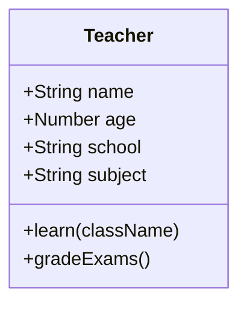
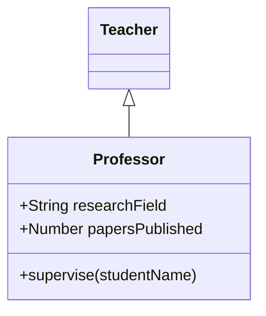

# JavaScript 核心语法练习2 代码解释

## 1. 类和对象

### 1.1 定义教师类


### 1.2 创建教师对象
```javascript
let MrMa = new Teacher("马", 28, "实验小学", "语文");
MrMa.learn("三年级二班");
MrMa.gradeExams();
```

## 2. 继承

### 2.1 定义教授类


### 2.2 创建教授对象
```javascript
let profZhou = new Professor("周", 35, "清华大学", "新闻传播学院", "新闻学", 12);
profZhou.supervise("李明");
```

## 3. 回调函数
```javascript
setTimeout(function () { console.log("下课铃响了") }, 1000);
```

## 4. DOM操作

### 4.1 获取元素
```javascript
let myh1 = document.getElementById("demo");
```

### 4.2 修改元素内容
```javascript
myh1.innerHTML = "欢迎使用教师信息管理平台";
```

### 4.3 修改元素样式
```javascript
myh1.style.color = "#aa0000";
```

### 4.4 事件处理
```javascript
myp.onclick = function () {
    alert("马老师 - 语文 - 28岁 - 实验小学");
}
```

### 4.5 页面加载事件
```javascript
window.onload = function () {
    alert("系统初始化完成");
}
```